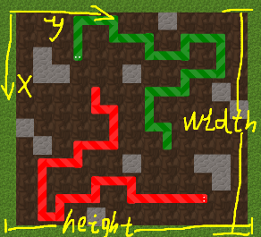

# 垃圾人工智障 + 1

**一个Botzone平台的Snake游戏bot**

## 思路

砍一棵蒙特卡洛树，混合一些随机的重金属和草药丢到炉子里去。

评价为：纯随机强行模拟结果-垃圾，搞一个估值函数并高一点乱七八糟的东西-稍好点，与对手折中一下-貌似好了许多但还是垃圾。

## 在Botzone平台上玩蛇

将目录`TigerStripeSharnake`和文件`__main__.py`打包成zip压缩包上传为Bot游玩即可。

## 创造一条自定义蛇

**代码可以直接对接游戏，欲自定义蛇，只需要自定义蛇的行为逻辑。**

在`TigerStripeSharnake\snake`目录建立一个蛇的源文件，创建继承**SnakeBase**类的子类，并重写**get_rule**方法。

## 怎么有这么多花里胡哨的文件

由于前期准备不足，对游戏交互和方向设定不够了解，外加Snake文档中的初始化格式和真实情况有点出入（也许是我的锅），导致后期又做了些修改，代码逻辑有点冗余。

1. 设计中坐标x，y与Botzone的Snake游戏相反，在数据解析类Jsoner中又互换了x，y。游戏的方向设定是这样的:

   

2. 没注意到程序每个周期只有一次输入输出，直接按照游戏服务器可以保存进度的模式实现了不必要的Game类。

3. Snake文档初始化语句有两个玩家的坐标，Game类经常同时使用两个玩家的坐标，而真实情况只有一个。控制AI蛇的SnakeBase类在实现时使用了Game类，导致后期修改代码后增加了一些本可以避免的复杂判断。

## =====???

大概瞎搞了一个垃圾web版界面，写的随意，吃带宽